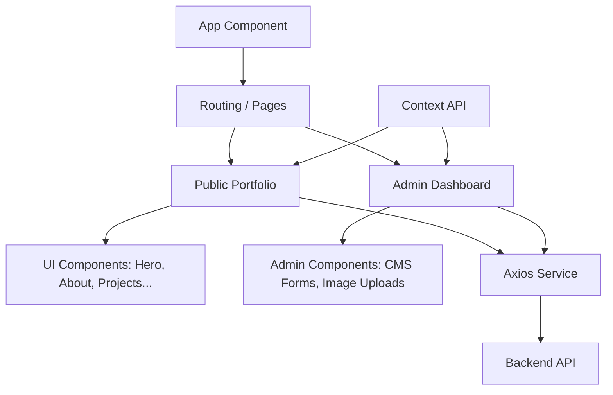

# Vilal Frontend - Personal Portfolio & CMS 🚀


## 📖 About the Project
This is the frontend component of Vilal Ali's personal portfolio and Content Management System (CMS). Built with modern web technologies, it features a highly interactive user interface, an AI-powered chat widget, and an administrative dashboard to manage portfolio content dynamically.

## 🏗️ Architecture
The frontend architecture follows a component-based approach utilizing React and Vite for lightning-fast builds. It uses React Router for client-side routing, Tailwind CSS for utility-first styling, and Context API for global state management (such as Theme and Authentication).



## 🧩 Project Components & Functionalities
- **Portfolio Views:** Sections for Hero, About, Projects, Experience, Education, Skills, Services, Testimonials, and Publications.
- **Admin Dashboard:** A secured area to perform CRUD operations on portfolio content (e.g., uploading new projects, updating CV, editing blogs).
- **AI Chat Widget:** A floating interactive assistant integrated with the backend's Gemini API route to answer questions about the portfolio.
- **Markdown Rendering:** Utilizes `@uiw/react-md-editor` and `react-markdown` for rich text editing and viewing in blogs and projects.
- **Dark/Light Mode:** Integrated theme switching using Context and Tailwind's dark mode strategies.

## 📂 Directory Structure
```text
vilal-frontend/
├── public/              # Static assets (images, CV, icons)
├── src/
│   ├── components/      # Reusable UI components & Admin specific components
│   ├── context/         # Context providers (ThemeContext, AuthContext)
│   ├── hooks/           # Custom React hooks
│   ├── lib/             # Utility libraries and helper functions
│   ├── pages/           # Page components representing routes
│   ├── services/        # API communication layer (Axios instances)
│   ├── styles/          # Global styles (Tailwind imports)
│   ├── App.tsx          # Main application component & Router wrapper
│   ├── main.tsx         # Application entry point
│   └── index.css        # Entry stylesheet
├── vite.config.ts       # Vite bundler configuration
├── tailwind.config.js   # Tailwind configuration
├── tsconfig.json        # TypeScript configuration
└── package.json         # Project metadata and dependencies
```

## ⚙️ Project Setup Steps
1. **Clone the repository:**
   ```bash
   git clone git@github.com:AetherX-AI-Labs/vilal-frontend.git
   cd vilal-frontend
   ```
2. **Install dependencies:**
   Make sure you have Node.js installed, then run:
   ```bash
   npm install
   ```
3. **Environment Setup:**
   Create a `.env` file in the root directory if needed (e.g., `VITE_API_URL=http://localhost:3001/api`).

## 🚀 Project Running Steps
- **Development Server:**
  ```bash
  npm run dev
  ```
  The app will typically run on `http://localhost:5173`.

- **Production Build:**
  ```bash
  npm run build
  ```
  This creates an optimized build in the `dist` folder.

- **Preview Production Build:**
  ```bash
  npm run preview
  ```

## 👨‍💻 Author Details
- **Name:** Vilal Ali
- **Role:** Lead Platform Architect & Principal Engineer
- **GitHub:** [AetherX-AI-Labs](https://github.com/AetherX-AI-Labs)
